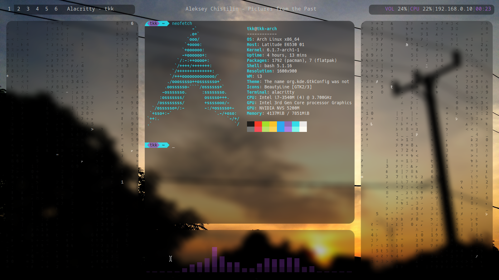

# dotfiles
These are my configs.
# Installation:
Read through the install script and run it with `sudo ./install`. (If you don't use sudo, the script cannot copy the bin folder. If this is not a problem for you then you can run it without sudo). 

Unless you somehow have my exact preferences, you will probably want to change the keybindings for i3 and vim (~/.config/i3/config and .vimrc).

# Screenshots

# Other configs
Librewolf Theme(Firefox): Tokyo Night https://addons.mozilla.org/en-US/firefox/addon/tokyo_night/?utm_source=addons.mozilla.org&utm_medium=referral&utm_content=search

VSCode Theme: Neon Dark https://open-vsx.org/vscode/item?itemName=Sudhan.neondark-theme